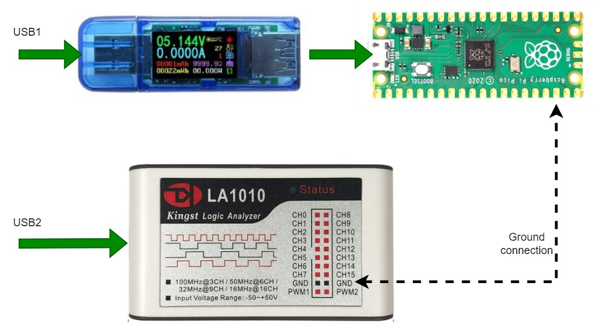

## Hardware setup.

In this setup the power supply to the embedded system is provided via an USB port or an USB power adapter.

I use this USB tester (voltage, current and energy monitoring) : https://amz.run/5nRm 

And this logic analyser : https://amz.run/5nRn 

For the first test, I ran a simple MicroPython [blink.py](blink.py) program.

Before connecting the logic analyser ground connection, the measured current was 18.6 mA when the LED is off and 20.7 mA when it is on.

When I connected the ground wire, these values changed a lot. We will discover why in the next section.
